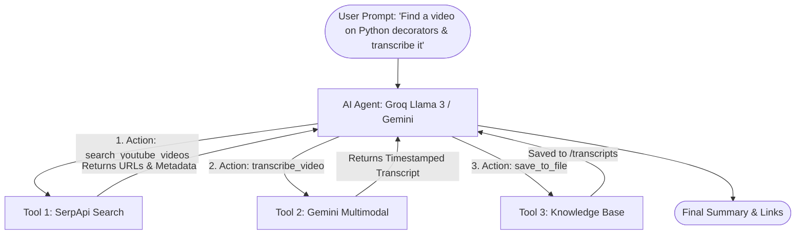

# 🎬 AI Video Search & Transcription Agent (with Tool Calling)

An autonomous AI Agent built in Python that searches YouTube videos using **SerpApi**, extracts & transcribes audio using **Google Gemini Multimodal API**, orchestrates actions via **Tool Calling (Groq / Gemini)**, and saves notes to a persistent **Knowledge Base**.

---

## 📖 Beginner's Concept Guide: How It Works

### 1. What is Tool Calling (Function Calling)?
Large Language Models (LLMs) are great at language, but they cannot directly access live websites or execute local code. **Tool Calling** gives the AI Agent tools:
1. We give the agent a dictionary of Python functions with names, descriptions, and expected parameters.
2. When you give a prompt (e.g. *"Find a tutorial on Python Decorators and transcribe it"*), the LLM decides:
   - *"Step 1: I need to search YouTube for videos about Python Decorators."* $\rightarrow$ calls `search_youtube_videos(query="Python Decorators")`
   - *"Step 2: I got a video URL `https://...`. Now I need to transcribe it."* $\rightarrow$ calls `transcribe_video(video_url="https://...")`
3. Our Python code executes each tool and feeds the result back to the LLM.
4. The LLM presents the final answer and saves the results in the Knowledge Base.



---

## 🛠️ Tech Stack & APIs

| Component | Technology | Purpose |
|---|---|---|
| **Agent Brain** | **Groq API** (`llama-3.3-70b`) / **Gemini** | Lightning-fast Tool Calling and multi-step reasoning |
| **Video Search** | **SerpApi** | Searches YouTube and retrieves video URLs and metadata |
| **Transcription** | **Gemini 2.0 / 1.5 Multimodal** | Analyzes audio streams, producing timestamped transcripts & summaries |
| **Audio Stream Extractor** | **yt-dlp** | Streams YouTube audio without downloading heavy video tracks |
| **Knowledge Base** | Python File IO | Saves structured `.md` and `.json` notes in `transcripts/` |
| **Terminal Interface** | **Rich** | Clean terminal UI with status spinners and formatted panels |

---

## 🚀 Quickstart Guide

### 1. Clone & Install Dependencies
This project uses `uv` for fast package management:

```powershell
uv sync
```

Or using standard `pip`:
```powershell
pip install -e .
```

### 2. Configure API Keys
Copy `.env.example` to `.env`:

```powershell
cp .env.example .env
```

Open `.env` and paste your API keys:
- **`SERPAPI_API_KEY`**: Get free 100 searches/mo at [serpapi.com](https://serpapi.com/)
- **`GEMINI_API_KEY`**: Get free access at [Google AI Studio](https://aistudio.google.com/app/apikey)
- **`GROQ_API_KEY`**: Get free access at [Groq Console](https://console.groq.com/keys)

---

## 💻 Running the Agent

Start the interactive CLI:

```powershell
python main.py
```

### Example Commands You Can Try:
1. **Search & Transcribe automatically:**
   > *"Find a short video on Python list comprehensions and transcribe it."*
2. **Direct Video Transcription:**
   > *"Transcribe this YouTube video: `https://www.youtube.com/watch?v=kqtD5dpn9C8`"*
3. **Inspect Knowledge Base:**
   > *"What transcripts have been saved in my knowledge base?"*

---

## 📂 Project Structure

```text
ai-video-transcribe-agent/
├── .env.example              # API key template
├── .env                      # Local secret keys (not committed)
├── pyproject.toml            # Dependencies and project metadata
├── main.py                   # Interactive CLI application
├── transcripts/              # Knowledge Base storing generated transcripts
└── src/
    └── ai_video_transcribe_agent/
        ├── config.py         # Loads and validates environment variables
        ├── agent/
        │   ├── schemas.py    # Tool definitions (JSON Schema for LLM)
        │   └── orchestrator.py# Multi-tool ReAct agent execution loop
        ├── tools/
        │   ├── video_search.py   # SerpApi search tool
        │   ├── transcription.py  # Gemini audio transcriber
        │   └── knowledge_base.py # File storage & reader
        └── utils/
            └── audio_downloader.py # yt-dlp audio extractor
```

---

## 🌟 Core Architecture & Engineering Highlights
- **Multi-Tool Calling**: Autonomous decision-making using industry-standard function calling specs.
- **Multimodal AI**: Direct audio processing via Gemini 2.0/1.5 API.
- **Resilient Fallbacks**: Clean error handling when network requests fail or invalid links are passed.
- **Zero Heavy Video Storage**: Extracts only lightweight audio (`.m4a`) to optimize speed and bandwidth.
