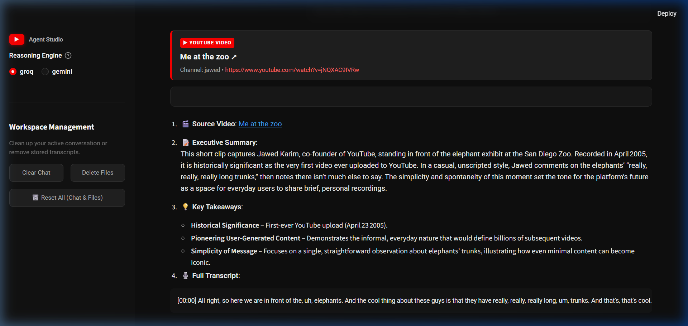
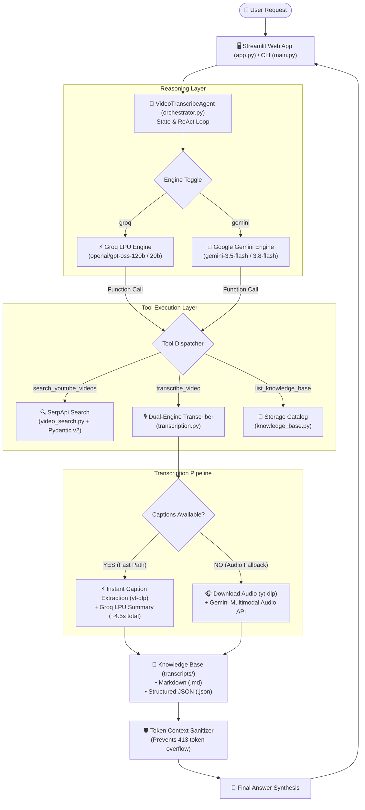

# 🎬 AI Video Transcribe Agent

> An autonomous AI-powered assistant that searches YouTube, transcribes video content with timestamps, synthesizes executive summaries, and builds a local Knowledge Base — powered by Tool Calling with Groq and Google Gemini.

[](https://ai-video-transcribe-agent.streamlit.app)
[](https://python.org)
[](https://streamlit.io)
[]()
[](LICENSE)

🌐 **Live Web Application**: [ai-video-transcribe-agent.streamlit.app](https://ai-video-transcribe-agent.streamlit.app)

---

## ▶️ YouTube Transcribe Agent



---

## ✨ Overview

The **AI Video Transcribe Agent** turns YouTube videos into structured, searchable notes in seconds. Instead of simply generating text, the agent autonomously decides when to search YouTube via **SerpApi**, extract transcripts and audio via **yt-dlp**, analyze content using **Groq** or **Google Gemini**, and persist structured notes to disk.

It comes equipped with both an interactive **YouTube-themed Streamlit Web App** and a terminal **CLI**.

---

## 🚀 Key Features

- **🔍 Smart Video Search**: Search YouTube directly by topic, question, or keyword to retrieve top-ranked videos with metadata (views, channels, links).
- **⚡ Instant Caption Extraction**: Fetches official and auto-generated timestamped captions in seconds without downloading heavy media files.
- **🎙️ Multimodal Audio Fallback**: For videos without captions, the agent automatically downloads the audio track and uses Google Gemini to listen and transcribe.
- **📝 Automated Summaries & Takeaways**: Generates concise executive summaries and actionable key takeaways alongside verbatim timestamped transcripts.
- **📁 Persistent Knowledge Base**: Automatically saves every transcription as both human-readable Markdown (`.md`) and machine-readable JSON (`.json`) in `transcripts/`.
- **🎛️ Dual Reasoning Engines**: Switch seamlessly between **Groq** (sub-second LPU reasoning) and **Google Gemini** (multimodal intelligence) directly from the sidebar.
- **🛡️ Built-in Resilience**: Automatic retries on API rate limits, model fallback chains, and Windows-safe file sanitization.

---

## 🏗️ System Architecture



### Workflow Lifecycle:
1. **Reason**: The agent evaluates your prompt using the ReAct (Reason + Act) tool calling loop.
2. **Act**: It invokes the necessary tool (search YouTube, transcribe a video, or list stored notes).
3. **Observe**: It processes the tool output, archives structured files to `transcripts/`, and returns a clean, formatted response.

---

## 🛠️ Tech Stack

- **Language**: Python 3.11+
- **Agent Orchestration**: ReAct Tool Calling loop (Groq API & Google GenAI SDK)
- **Video Search**: SerpApi
- **Media Extraction**: `yt-dlp`
- **Web Interface**: Streamlit (Custom YouTube Dark Theme)
- **Data Validation**: Pydantic v2
- **CLI Formatting**: Rich

---

## 🏁 Getting Started

### Prerequisites

- Python 3.11 or higher
- [uv](https://github.com/astral-sh/uv) (recommended) or `pip`

### 1. Installation

Clone the repository and install dependencies:

```bash
git clone https://github.com/Abdullah-iftikhar18/ai-video-transcribe-agent.git
cd ai-video-transcribe-agent
```

Using `uv`:
```bash
uv sync
```

Or using `pip`:
```bash
pip install -e .
```

### 2. Configure Environment Variables

Copy the template file to `.env`:

```bash
cp .env.example .env
```

Open `.env` and add your API keys:

```env
# Required for searching YouTube videos
SERPAPI_API_KEY="your_serpapi_key_here"

# Required for Gemini agent and audio transcription
GEMINI_API_KEY="your_gemini_key_here"

# Required for Groq agent and fast reasoning
GROQ_API_KEY="your_groq_key_here"

# Optional settings
DEFAULT_LLM_PROVIDER="groq"       # "groq" or "gemini"
DEFAULT_GROQ_MODEL="openai/gpt-oss-120b"
DEFAULT_GEMINI_MODEL="gemini-3.5-flash"
TRANSCRIPTS_DIR="transcripts"
```

> **API Key Links:**
> - [SerpApi (100 free searches/mo)](https://serpapi.com/)
> - [Google AI Studio (Free tier)](https://aistudio.google.com/app/apikey)
> - [Groq Console (Free tier)](https://console.groq.com/keys)

---

## 🖥️ Usage

### Web Dashboard (Streamlit)

Launch the interactive web application:

```bash
uv run streamlit run app.py
```

Then open `http://localhost:8501` in your browser.

**Web Features:**
- Interactive chat with live tool execution steps
- YouTube-themed dark UI with rich video cards
- Sidebar toggle to switch between Groq and Gemini on the fly
- Workspace management to clear chat history or wipe stored files

### Command-Line Interface (CLI)

Prefer the terminal? Run the interactive CLI:

```bash
uv run python main.py
```

### Example Prompts

- **Direct Transcription:**
  > `"Transcribe this video: https://www.youtube.com/watch?v=jNQXAC9IVRw"`
- **Search & Auto-Transcribe:**
  > `"Find a popular tutorial on Python async/await and transcribe the best one."`
- **Knowledge Base Query:**
  > `"What videos have I transcribed so far?"`

---

## 📂 Project Structure

```text
ai-video-transcribe-agent/
├── app.py                             # Streamlit web dashboard
├── main.py                            # Terminal CLI entrypoint
├── pyproject.toml                     # Dependencies and project metadata
├── requirements.txt                   # Production dependencies for cloud deployment
├── packages.txt                       # System dependencies (ffmpeg)
├── .env.example                       # Environment variables template
├── assets/                            # Application screenshots and demo assets
│   └── app_demo.png                   # Web app screenshot
├── transcripts/                       # Stored transcript notes (.md & .json)
├── src/ai_video_transcribe_agent/
│   ├── config.py                      # Configuration & model fallback management
│   ├── agent/
│   │   ├── orchestrator.py            # Core ReAct agent & multi-tool loop
│   │   ├── prompt.py                  # Agent persona & system guidelines
│   │   └── schemas.py                 # Tool definitions (JSON Schema)
│   ├── tools/
│   │   ├── video_search.py            # SerpApi search integration
│   │   ├── transcription.py           # Hybrid transcription & summarization
│   │   └── knowledge_base.py          # File management & sanitization
│   └── utils/
│       └── audio_downloader.py        # yt-dlp caption & audio extraction
└── tests/                             # Comprehensive automated test suite
    ├── test_config.py
    ├── test_audio_downloader.py
    ├── test_knowledge_base.py
    ├── test_video_search.py
    ├── test_transcription.py
    └── test_orchestrator.py
```

---

## 🧪 Running Tests

The project includes 25 unit tests covering all components:

```bash
uv run python -m unittest discover -s tests -p "test_*.py" -v
```

---

## 📄 License

Distributed under the MIT License. See `LICENSE` for more information.
